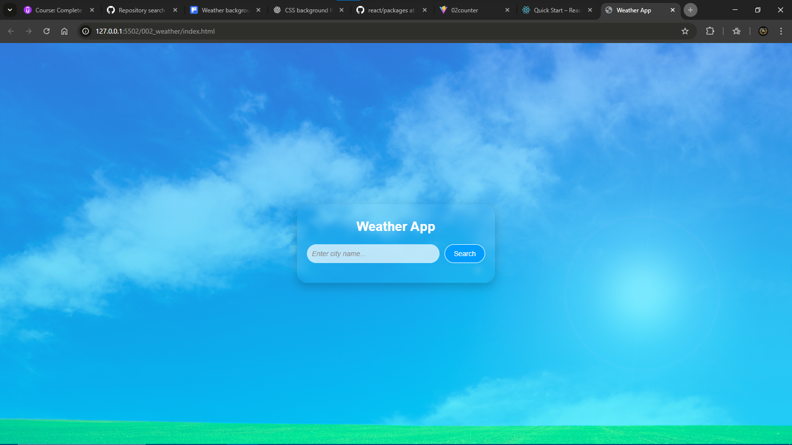

# 🌦️ Weather App

A clean, elegant, and fully responsive Weather Application that allows users to search for any city and instantly view real-time weather details.  
Built with **HTML, CSS, and JavaScript**, this project focuses on UI simplicity, speed, and accurate weather reporting.

---

## 🏷️ Badges  
  
  
  

---

## 🌐 Live Demo  
🚀 **https://faaiz1505.github.io/Weather-App/**

---

## 📸 Preview
Here’s a preview of the app interface:


---

## ✨ Features  
- 🔍 Search weather by city name  
- 🌡️ Displays temperature, humidity, wind speed & conditions  
- 📱 Fully mobile responsive  
- ⚠️ Handles invalid city searches  
- ⚡ Fast and smooth user experience  
- 🎨 Clean and modern UI  
- 🌐 Works on all browsers  
- 🔄 Smart error and network handling  
- 🔎 "City not found" detection  

---

## 🧠 About This Project  
This Weather App was built to strengthen skills in **JavaScript DOM manipulation**, **API handling**, and **responsive design**.  
The goal is to create a simple but beautiful tool that users can rely on to check weather conditions anywhere in the world.

---

## 🛠️ Technologies Used  
- **HTML5**  
- **CSS3**  
- **JavaScript (ES6+)**  
- **Weather API (OpenWeatherMap)**  

---

## 📥 Installation (Run Locally)

1. Clone the repo:
   ```bash
   git clone https://github.com/FAAIZ1505/Weather-App.git

2. Open the project folder
3. Run:
   ```bash
   index.html

## 4. Your browser will open the app automatically

---

📱 Mobile Responsiveness

Designed to work perfectly on:

Android phones, iPhones, Tablets, Laptops & Desktops

The layout automatically adjusts without cutting or overflowing content

---

## 🛡️ Error Handling

The app has strong error checks:

* ❌ Invalid city name

* 📭 Empty input

* 🌐 Network/API failures

* 🛑 Prevents app crash

Users always get a friendly and clear message.

---

## 🚀 Future Improvements

* 📅 5-Day Forecast

* 🗺️ Auto-detect location using Geolocation API

* 🖼️ Dynamic backgrounds (rainy, sunny, cloudy, etc.)

* 🕒 Show local time of searched city

* 🔔 Weather alerts

---

## 🧑‍💻 Author

Nasirudeen Faaiz (NafasHub)
Frontend Developer — HTML, CSS, JavaScript

---

## Contact:

GitHub: https://github.com/Faaiz1505

Email: nasirudeenfaaiz755@gmail.com

Whatsapp: [Chat with me->](https://wa.me/2348012345678?text=Hello!)

## 📄 License

This project is open source under the MIT License.
Feel free to use, modify, and share
